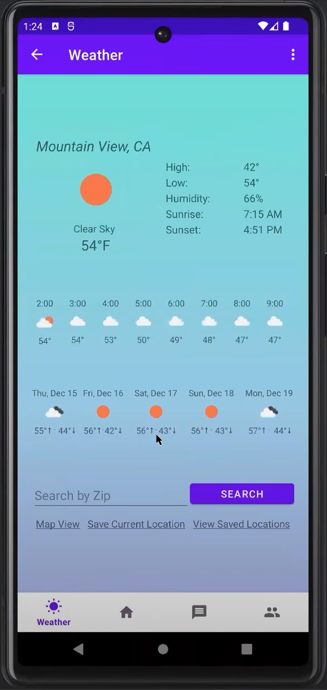
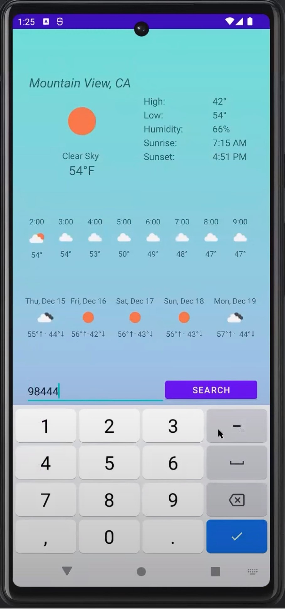
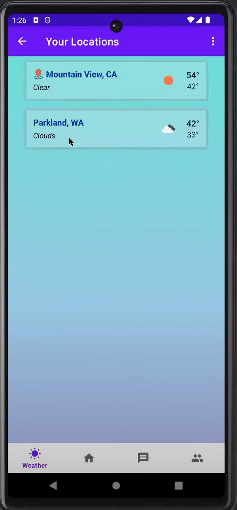
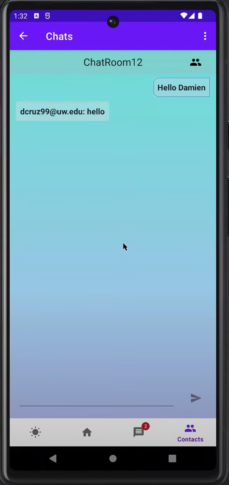

# Weather Chat Mobile App

Chat Weater mobile app for TCSS 450.
---

Check a detailed weather forecast of your location in a mobile app. 
See today's hourly forecast or this week's forecast

Check a different locations' forecast by entering the zipcode.

Save a location for easy weather forecast access

As a bonus, you can chat with your friends after checking the weather.
You can talk about the weather!

----
Tech Stack: Java, Kotlin, Android Studio
Uses OpenWeatherAPI
----
Click here for demo video: https://www.youtube.com/watch?v=8IAD4L3T-H8
